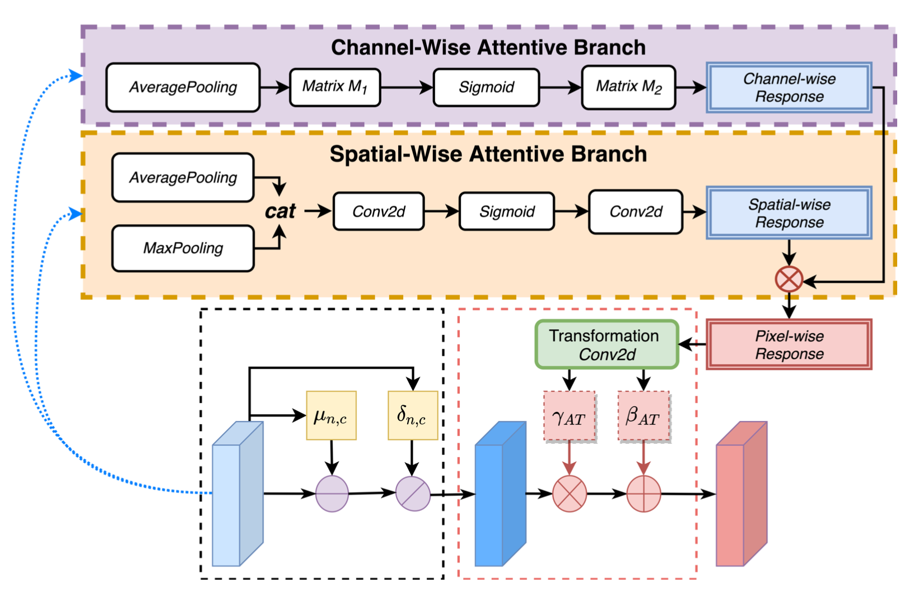

# Improving Breast Tumor Segmentation in PET via Attentive Transformation Based Normalization

The repo contains PyTorch Implementation of Attentive Transformation (AT)-based Normalization method.

## Overview

The spatial and channel attentive importance response can be captured by channel-wise attentive branch and spatial-wise attentive branch. Pixel-dependent learnable parameters are generated with the transformation on pixel-wise response map obtained by a combination of channel-wise and spatial-wise attentive response maps.The workflow of attentive transformation based normalization method is illustrated as below:



## Install/Check dependencies

```pip3 install requirements.txt```

## Overview of a dataset folder

A dataset folder should look like this:

```
└── original_image_path
	├── Image
    	│   └── PET_001
  	│       ├── PET_001_PET_1.npy
   	│       ├── PET_001_PET_2.npy
   	│       ├── PET_001_PET_3.npy
   	│       ......
	└── Mask
            └── PET_001
           	├── PET_001_Mask_1.npy
 		├── PET_001_Mask_2.npy
             	├── PET_001_Mask_3.npy
                ......
```

The dataset is preprocessed and saved with single 2D slices in format ".npy".

Please modify "original_image_path"  with your own configuration.

## Instruction

We indroduce [argsparse](https://docs.python.org/3/library/argparse.html) for ease of running our code. For detailed information, see:

```
python3 ./main.py --help
```

##### Baseline:

```
# Here we use BN as an example
python3 ./main.py --struct_name BN --batch-size 10 --epochs 100
```

#####  Attentive Transformation(AT) based Normalization:

```
python3 ./main.py --struct_name AT  --original_image_path xxx --batch-size 10 --epochs 100 
```

## Reference

- https://github.com/milesial/Pytorch-UNet
- https://github.com/dvlab-research/AttenNorm
- https://github.com/gbup-group/IEBN
- https://github.com/anthonymlortiz/lcn

## Citations

```
@article{qiao2021atnorm,
  title={Improving Breast Tumor Segmentation in PET via Attentive Transformation Based Normalization},
  author={Xiaoya Qiao, Chunjuan Jiang, Panli Li, Yuan Yuan, Qinglong Zeng, Lei Bi, Shaoli Song, Jinman Kim, David Dagan Feng and Qiu Huang},
  year={2021}
}
```
